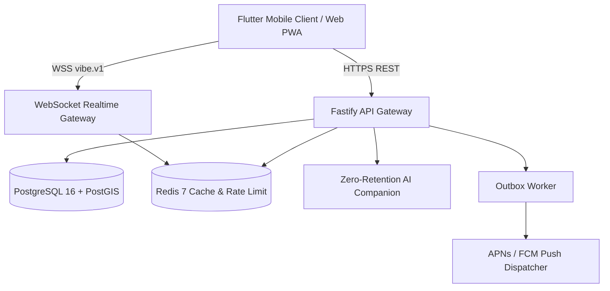
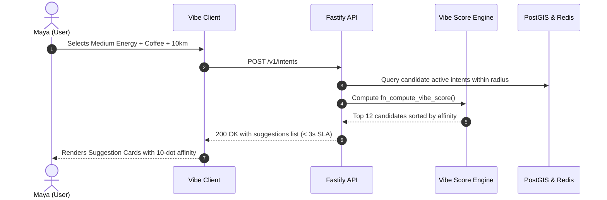
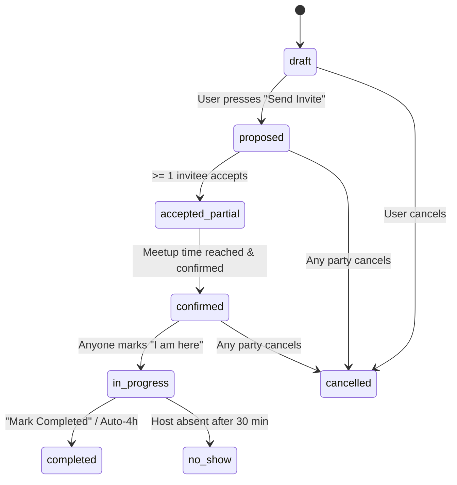

# Vibe Architecture Diagrams (ASCII & Mermaid)

## 1. System Topology



## 2. Intent-to-Match Flow



## 3. Meetup Lifecycle State Machine (Chapter 4.5 & 36.5)



## 4. Privacy & End-to-End Journal Encryption (Chapter 9.5 & 36.6)

```
[User Text] ───→ [Argon2id(Passphrase)] ───→ [Key]
                         │
                         ▼
        [XChaCha20-Poly1305 Encrypt]
                         │
                         ▼
      [Ciphertext + Nonce + Salt] ───→ Server (Opaque Blob)
```
